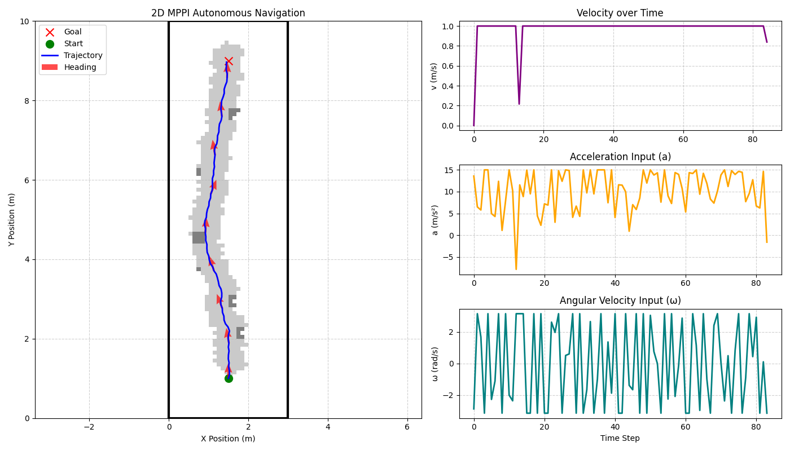
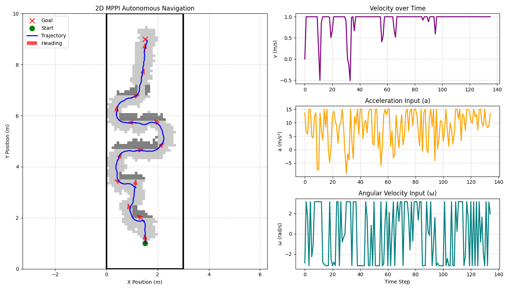

# 2D Autonomous Navigation using MPPI

This repository contains a Python implementation of a purely sampling-based Model Predictive Path Integral (MPPI) controller for autonomous navigation in unknown 2D environments. The system uses a 2nd-order unicycle kinematic model and leverages JAX for hardware-accelerated, highly parallelized trajectory sampling.

Instead of relying on a traditional global path planner (like A* or Dijkstra), this project uses a receding horizon control strategy. The controller handles obstacle avoidance and exploration natively by evaluating collision costs and line-of-sight perception costs across thousands of forward-simulated trajectories.

## Results

### Pole Field Navigation


<video src="plots_and_animations/pole.mp4" controls="controls" style="max-width: 800px;">
</video>

### Maze Navigation


<video src="plots_and_animations/maze.mp4" controls="controls" style="max-width: 800px;">
</video>

## Repository Structure

* `main.py`
  The main entry point for the simulation. It sets up the environment parameters, initializes the ground truth and belief maps, and runs the core simulation loop. It handles the receding horizon control updates and triggers the visualization tools upon completion.

* `functions.py`
  Contains the core mathematical and logical components of the simulation, optimized using `@jax.jit` and `jax.vmap` for performance. This includes:
  * 2nd-order unicycle dynamic steps (Euler integration).
  * Belief map updates simulating a limited field-of-view sensor.
  * Ray-casting operations for line-of-sight checks.
  * The complete MPPI optimization step, including Monte Carlo noise sampling, cost evaluation (trajectory, obstacle, and perception costs), and the softmax weight update.

* `plotting.py`
  Handles all visualization outputs using Matplotlib. It generates the static plots showing the trajectory and control histories, and compiles the frame-by-frame state history into `.mp4` animations.

* `2D_autonomous_navigation_MPPI.pdf`
  A detailed project report formatted in IEEE style outlining the dynamical system, MPPI formulation, and results.

* `requirements.txt`
  Contains the exact Python package dependencies and versions needed to run the simulation without conflicts.

## Installation

To run this project, you will need Python 3 installed. It is recommended to use a virtual environment. 

1. Clone the repository:
```bash
git clone <your-repository-url>
cd 2D-PA-MPPI
```

2. Install the required dependencies:
```bash
pip install -r requirements.txt
``` 

## Usage 
Run the main script to execute the simulation. The maps, start/goal positions, and MPPI parameters (horizon, sample size, temperature) can be configured directly inside the script. 
```bash
python main.py
```  
Outputs will be saved automatically to the plots_and_animations directory.